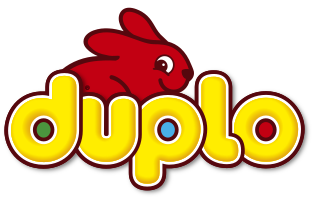
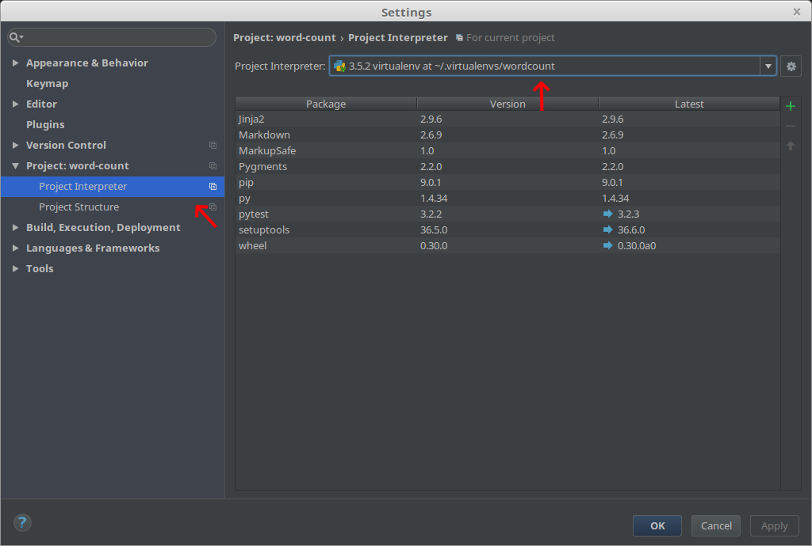
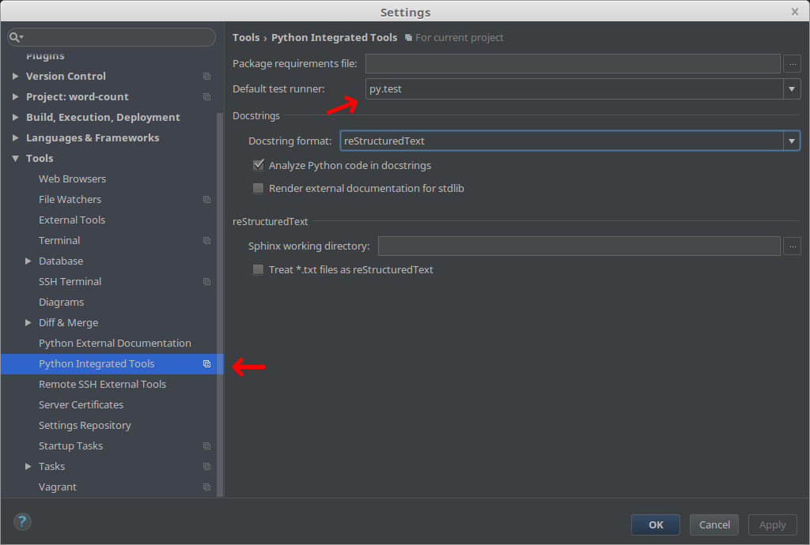
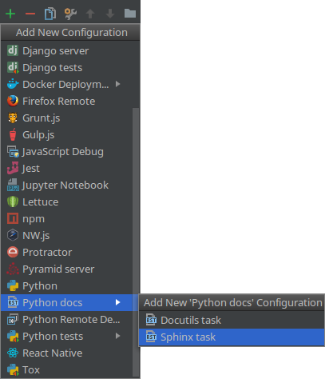
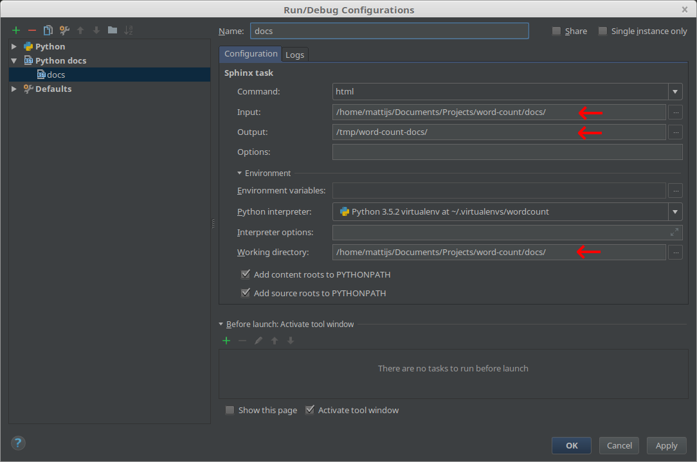
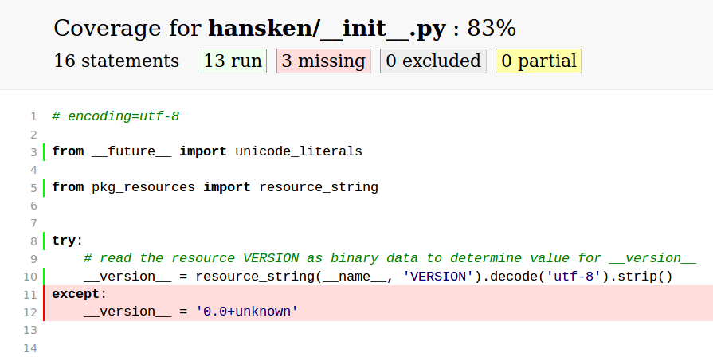
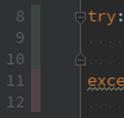

Python alsof het *echte* software is
====================================

Hoezo?!
-------

- FBDA's weapon of choice
- zowel losse scripts  als 'libs'
- herbruikbaarheid non-triviaal
- geringe ervaring met tooling
- impulsgroep DUPLO™

Invulling
---------

- typisch los script (doet het!): `wordcount.py`
- nou nog herbruikbaar…
- spelen met veelgebruikte tooling
    - `pytest`, `setuptools`, `sphinx`, `tox`, `wheel`, …
    - PyCharm
- disclaimer: dit is een dive, geen *deep* dive

Not Invented Here™
------------------

- github's trending python projects als inspiratie (`keras`, `requests`, …)
- project-layout (`test_dingen.py` of `tests/test_iets.py`, …)
- gebruikte tools (`pytest` of `unittest2`, …)
- verder: "populaire conventie"

What TODO
---------

- `virtualenv`
- unittests met `pytest`
- packaging met `setuptools` en `wheel`
- documentatie met `sphinx`
- automatisering met `tox`
- eventueel
    - 'lint' met `flake8`
    - test/code coverage met `coverage`

Requirements
------------

- `git --version`
- `python3 --version`
- `pip --version` (verwijst naar welke versie van Python?)
    - eventueel `pip3`
- `pip show pip`
- PyCharm (community of professional)

Woordjes tellen
---------------

- live meeklikken (of kopie-pasta): `https://akaidiot.github.com/word-count/`

~~~~ text
$ git clone https://github.com/akaIDIOT/word-count.git
$ python3 wordcount.py map/met/tekst
[('de', 123), ('het', 45), ('een', 6)]
~~~~

Virtual reality
---------------

Alle DUPLO-blokken netjes in de doos:

~~~~ text
$ pip install virtualenv
$ virtualenv --python python3 pad/naar/env
$ source pad/naar/env/activate   # *nix
$ pad\naar\env\Scripts\activate  # windows
~~~~

Virtual reality: PyCharm
------------------------

Virtual reality
---------------

Unit tests
----------

- een 'unit' is klein
- `wordcount.py` is niet handig testbaar ☹ (één unit)
- eerst fixen of eerst tests maken?
    - pragmatisme of test driven development

*populaire conventie: test-code in `…/tests/`*

Unit tests: pytest
------------------

~~~~ text
$ pip install pytest
~~~~

`…/tests/test_wordcount.py`:

~~~~ python
from wordcount import tokenize

def test_tokenize():
    text = 'De kat krabt de krullen van de trap.'
    words = tokenize(text)

    assert 'krullen' in words
    assert 'trap' in words
~~~~

Unit tests: PyCharm
-------------------

Rechts-klik op `tests`, ▶ Run 'py.test in tests'

Bonus tests
-----------

`pytest` heeft handige helpers, `pyhamcrest`[^1] maakt één en ander leesbaarder:

~~~~ python
@pytest.mark.parametrize('text, words', [
    ('test', ['test']),
    ('testing\n123', ['testing', '123']),
])
def test_tokenize_fancier(text, words):
    assert_that(tokenize(text),
                contains_inanyorder(*words))
~~~~

`mock` / `unittest.mock` kan dingen die in de weg zitten (HTTP-requests, database-cursors, …) 'mocken'

[^1]: importeer uit module `hamcrest`

Unit tests
----------

Packaging
---------

- pakketje wat Python 'snapt'
- Python packages, modules *en dependencies*

*(niet alleen) populaire conventie: `…/setup.py`*

Packaging: `setup.py`
---------------------

~~~~ python
from setuptools import setup

setup(
    name='wordcount',
    version='0.0',             # see PEP-440
    description='Count words, duh',
    author='Henk de Vries',
    author_email='henk.de.vries@nfi.minvenj.nl',
    py_modules=['wordcount'],  # single module
    install_requires=[],       # no dependencies
)
~~~~

Packaging: `wordcount.tar.gz`
-----------------------------

~~~~ text
$ python setup.py bdist
$ ls dist/
wordcount-0.0.linux-x86_64.tar.gz
~~~~

euh… `x86_64`? `.tar.gz`? ☹

Packaging: `wordcount.whl`
--------------------------

~~~~ text
$ pip install wheel
$ python setup.py bdist_wheel
$ ls dist/
wordcount-0.0-py3-none-any.whl
~~~~

oeh, `py3-none-any`, `.whl` ☺

Packaging: `pip install wordcount`
----------------------------------

- afdeling heeft een PyPI-server (😘 FIG)
- iedereen heeft leesrechten
- schrijfrechten op aanvraag
- configuratie op confluence

~~~~ text
$ twine upload --repository dbs dist/*.whl
~~~~

Packaging
---------

Requirements
------------

- `requirements.txt` bekend
- `pip freeze`?
- waar depend je nou echt op?
    - `requests==1.2.3` of `requests`
    - `neo4j==3.2.1rc4` of `neo4j>=3`

Requirements: `setup.py`
------------------------

definieer je *echte dependencies* in `setup.py`:

~~~~ python
from setuptools import setup

setup(
    ...,
    install_requires=[
        'requests',
    ]
)
~~~~

Requirements: `requirements.txt`
--------------------------------

laat een tool vervolgens je *development dependencies* bepalen:

~~~~ text
$ pip install pip-tools
$ pip-compile --output-file requirements.txt setup.py
~~~~

~~~~ requirements
certifi==2017.7.27.1      # via requests
chardet==3.0.4            # via requests
idna==2.6                 # via requests
requests==2.18.4
urllib3==1.22             # via requests
~~~~

Requirements
------------

Documentatie: Sphinx
--------------------

- krachtige tool, maar veel TLC nodig…
- geconfigureerd in Python
- genereert documentatie vanaf `index.rst`
- reStructuredText (☹)
- importeert code, rendert docstrings zoals bijv. *readthedocs.org*

Documentatie: Sphinx
--------------------

~~~~ text
$ pip install sphinx
$ cd …/word-count
$ sphinx-quickstart
> Root path for the documentation [.]: docs
…
> autodoc: automatically insert docstrings from modules (y/n) [n]: y
…
> Create Makefile? (y/n) [y]: n
> Create Windows command file? (y/n) [y]: n
~~~~

*populaire conventie: doc root in `…/docs/`*

Documentatie: `conf.py`
----------------------

vies, maar hier nodig (staat er al bijna)…

~~~~ python
import os
import sys
sys.path.insert(0, os.path.abspath('..'))
~~~~

Documentatie: `index.rst`
-------------------------

~~~~ rest
.. toctree::
   :maxdepth: 2
   :caption: Contents:

   api
~~~~

Documentatie: `api.rst`
-----------------------

~~~~ rest
API Docs
========

.. automodule:: wordcount
   :members:
   :undoc-members:
~~~~

Niet per se fijn, eventueel in `conf.py`:

~~~~ python
autodoc_default_flags = ['members', 'undoc-members']
~~~~

Zie [Sphinx' `autodoc` doc](http://www.sphinx-doc.org/en/stable/ext/autodoc.html) voor meer

Documentatie: PyCharm
---------------------

Documentatie: PyCharm
---------------------

Documentatie
------------

Automatisering: tox
-------------------

- soort van `Makefile`
- één of meerdere 'testenvs'
- maakt zelf virtual envs
- daarna soort van shell script
- vooral handig voor build servers, herhaalbaarheid buiten je eigen bubbel

*populaire conventie: `…/tox.ini`*

Automatisering: `tox.ini`
-------------------------

normaliter *buiten* de virtualenv voor je project:

~~~~ text
$ pip install tox
~~~~

~~~~ ini
[testenv]
commands =
    …
deps =
    …
~~~~

~~~~
$ tox
…
~~~~

Automatisering: tests en docs
-----------------------------

~~~~ ini
# 'default' testenv
[testenv]
commands =
    py.test --strict tests/
deps =
    pytest

# non-default testenv named "docs"
[testenv:docs]
commands =
    sphinx-build -b html docs/ dist/docs/
deps =
    sphinx
~~~~

Automatisering: Python versies
------------------------------

~~~~ ini
# global config
[tox]
envlist = py33, py34, py35, py36
skip_missing_interpreters = True
~~~~

~~~~ text
$ tox
…  # (times 4)
~~~~

kan veel meer, zie vooral [tox.readthedocs.io](https://tox.readthedocs.io)

Automatisering
--------------

Style-checking
--------------

- programma's die zeuren dat je code lelijk™ is (bijv. PyCharm ☺)
- voor Python vrij goed gedefinieerd: PEP-8
- uniform met andere projecten; 'pythonic'
- *populaire conventie: `flake8`*
    - kent PEP-8 vrij goed
    - zeurt per regel
    - kan regels overslaan

Style checking: automatisering
------------------------------

~~~~ ini
[testenv]
# any failing command stops and fails env
commands =
    flake8 wordcount.py
    py.test --strict tests/
# flake8 does plugins, like pep8-naming
deps =
    flake8
    flake8-comprehensions
    pep8-naming
    pytest
~~~~

Style checking
--------------

Code coverage
-------------

- bijhouden welke code wel en niet geraakt is door een test
- geen doel, maar fijn middel om te zien of je test doet wat je bedoelde
- *populaire conventie: `coverage`*

Code coverage: automatisering
-----------------------------

~~~~ ini
[testenv]
# let coverage run py.test, generate HTML-report in dist
commands =
    coverage run --branch --source hansken --module py.test --strict tests/
    coverage html --dir dist/coverage/
deps =
    coverage
    pytest
~~~~

Code coverage: resultaat
------------------------

Code coverage: PyCharm (Professional)
-------------------------------------

Code coverage
-------------

DUPLO
-----

